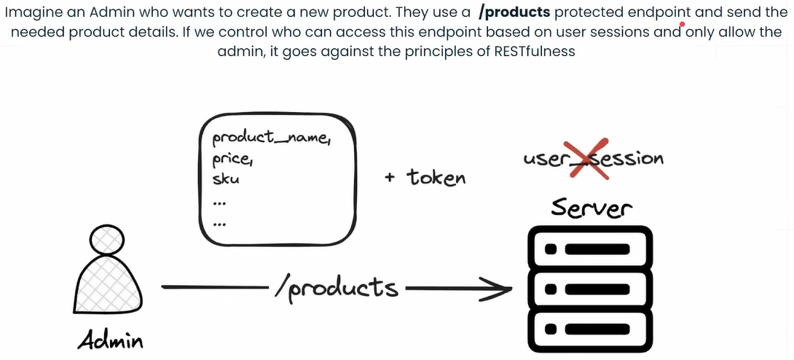
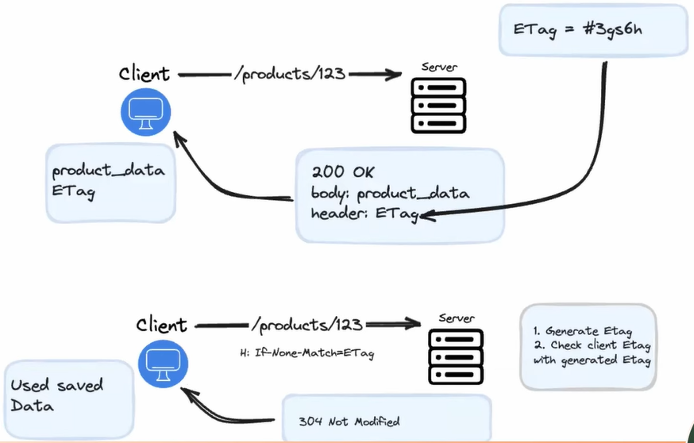

# REST API Design

## API First Approach

### Let's Begin With A Story

Suppose a client gives me a project about REST API with various functional requirements.
Here is the Details 

### The Problem

But after finished the project, the client emailed me with frustration.
He claimed the project failed because of some fundamental issues.
Here is the response. 

### What is API?

Now let's understand, What is API actually?
> **API acts as a contract point between web or interface communication.**

### API Types

There were many types of API, here are some example.

### Designing API

Why designing API is important, here is the reason. 

### Example of well structured API

WooCommerce Provide a well structured API design system. [Here is the link](https://woocommerce.github.io/woocommerce-rest-api-docs/). Another great example is [GitHub API](https://docs.github.com/en/rest?apiVersion=2022-11-28)

### API types based on consumer

There have different level of API based on consumer type. Those are 

### API Lifecycle


## API Design


### Constrains of REST API

The six constrains of REST API is,


1. **Client-Server**: The system should be divided into Client & Server

2. **Statelessness**: Each request from a client to the server must contain all the information necessary to understand and fulfill the request. The server should not maintain any client state between requests. If you manage user sessions in a RESTful API, you would essentially be introducing statefulness into your architecture, which goes against the statelessness constraint of REST. This constraint simplifies server design, improves reliability, and supports better scalability.


3. **Cacheability**: Responses from the server should be explicitly labeled as cacheable or non-cacheable. Caching can improve performance and reduce latency by allowing clients to reuse previously fetched responses.


4. **Uniform Interface**: The interface between the client and server should be uniform and consistent.
    This constraint is further divided into four sub-constraints:
    * **Identification of Resources**: 

    * **Manipulation of resources through:** 
    

    * **Self-descriptive message**: 

    * **Hypermedia as the engine of application state**:
    

Every good API provide API example as well. 

5. **Layered System**:
The architecture should be composed of multiple layers, with each layer having a specific responsibility. 
This constraint promotes modularity, encapsulation, and scalability by allowing intermediaries such as proxies 
and gateways to be inserted between clients and servers.

Benefits:

* A layered system makes the architecture simpler by hiding the complicated parts
* The architecture can change as needs change 
* Clients don't have to worry about how request are spread out

6. **Code-On-Demand**: Servers can optionally provide executable code (e.g., JavaScript) to clients, which can 
be executed within the client's runtime environment. This constraint enhances the functionality and flexibility
of the client but is not required for a system to be considered RESTful. Usually, it's not a good idea to use 
this constraint because hackers might alter the response body and insert malicious code.

## REST API Maturity Level

## Handling Partial Responses

Partial response is a method that lets API users choose what information they want in the response. For example, 
imagine you have an online store with a website and a mobile app. On the website, you want to get details like 
"product name", "price", "photo", "category" and "stock" from the catalog service. But on the mobile app, you only 
need "product name" "photo" and "price." By using Partial response, API users can request only the specific data 
they require.

To request a partial response that includes only the "product name" "photo" and "price" fields, the client would 
make a request to the server like this:

```js
    GET /api/v1/products?fields=name,photo,price

    GET {{base_url}}/products/sort=name&order=desc&page=1&limit=5&fields=name,price,status
```

### Benefits of Partial Response

* Reduced Bandwidth Usage: By fetching only the necessary fields, partial response reduces the amount of data 
transferred between the client and server. This can significantly decrease bandwidth usage, especially for large 
resources with many f fields.

* Improved Performance: With reduced data transfer, partial response can lead to faster response times and improved performance, particularly for clients with limited network bandwidth or slower connections.

* Optimized Client-Side Processing: Clients often only need a subset of fields from a resource for their specific  use case. By requesting only the required fields, clients can optimize their processing and memory usage, leading  to more efficient client-side operations.

* Simplified API Consumption: Partial response simplifies API consumption by allowing clients to specify exactly which fields they need, rather than filtering out unnecessary fields on the client side. This results in cleaner  and more concise code on the client side.

* Reduce over-fetching: Over-fetching occurs when an API sends more data than necessary, leading to wasted bandwidth and increased processing time on both the client and server. Partial response helps mitigate over-fetching by allowing clients to retrieve only the required fields. 

### Query Parameter

Query parameters are a fundamental aspect of HTTP requests used to specify additional information for a resource retrieval or manipulation operation. They are appended to the URL of the request and consist of a key-value pair separated by an equal sign (=) and delimited by an ampersand (&) if multiple parameters are present.

Query parameters serve various purposes in RESTful architecture, including:

* Filtering: Clients can use query parameters to filter resources based on specific criteria. For example, in an e-commerce API, clients might want to retrieve only products of a certain category or within a particular price range.

Example: `/products?priceMin=600&priceMax=2000`

* Sorting: Query parameters allow clients to specify the order in which resources should be returned. This is useful when clients want to retrieve resources in a particular order, such as alphabetical. 

* Pagination: When dealing with large datasets, pagination is essential to retrieve data in manageable chunks. Query parameters like limit and offset or page enable clients to request a specific subset of results.

Example: `/products?limit=10&page=1`

* Projection: Clients can use query parameters to specify which fields of a resource should be included or excluded in the response. This is helpful when clients only need a subset of fields for their use case, reducing bandwidth usage and improving performance.

Example: `/products?fields=name,price,photo`

* Search: Query parameters can be used to perform full-text search or keyword-based search within resources. Clients can specify search terms as query parameters to retrieve relevant results from the API.

Example: `/products?search=iphone`

### Example a partial API Response

Let's consider an example of a /products endpoint in an e-commerce API that supports various query parameter for filtering, sorting, pagination, and projection. 

`GET /products?priceMin=600&priceMax=2000&sort=price&order=asc&pae1&limit=10?fields=name,photo,price`

* The base URI is `/products`, representing the collection of products.
* The query parameters are used to filter the products based on certain criteria.
* The `sort=price` parameter indicates that the products should be sorted based on their price.
* The `order=asc` parameter specifies that the sorting should be in ascending order. You can use desc for descending order.
* The `page=2` parameter indicates that the results should be paginated, and the response should include the products from the second page.
* The `limit=10` parameter specifies that each page should contain a maximum of 10 products.

So the response of this api will be look like this

```js
{
    "status": 200,
    "message": "success",
    "data": [
        {
            "id": "2345678",
            "name": "Product Name",
            "photo": "https://store.com/photo1.png",
            "price": 55
        },
        {
            "id": "8765432",
            "name": "Product Name",
            "photo": "https://store.com/photo2.png",
            "price": 65
        }
    ],
    "pagination": {
        "page": 2,
        "limit": 10,
        "totalPages": 5,
        "totalItems": 50,
        "links": {
            "self": "/products?page=1",
            "next": "/products?page=2"
        }
    }
}
```

## REST API error response

Handling errors in a RESTful API involves following certain principles to ensure consistency, clarity and ease of use for clients. 

1. Use standard HTTP status codes: Some common HTTP status codes for error handling includes: 

    * 400 Bad request
    * 401 Unauthorized
    * 403 Forbidden
    * 404 Not found
    * 422 Unprocessable Entity
    * 500

2. Provide Descriptive Error Message
3. Follow a Consistent Error Format
4. Include Error Details
5. Handle Uncaught Exceptions Gracefully

The response body includes an error object with the following fields:

* Code: The HTTP status code indicating the type of error (404 in this case).
* Message: A human-readable error message describing the problem (Product not found).
* Hints: Additional details providing context about the error (The requested Product with ID '123' does not exist).
* Trace Id: Trace ID helps the API provider company easily identify the root cause of the error.

If the success scenario occurs, it should also provide the required data and follow the HATEOAS principle. 

## HTTP Cache-Control

### HTTP Cache-Control Directives

* Max-Age: Specifies the maximum time(in second) that a response can be cached by the client or intermediary caches. 
For example: `cache-control: max-age=3600` indicates that the response can be cached for up to one hour. 

* S-Max-Age
* No-Cache
* No Store

### Public Cache

Public Cache Specifies that a response can be cached by any cache, including both private (client-side) caches and shared caches (e.g., proxies). Sensitive data should not be cached

For example: `Cache-Control: public`

### Private Cache

Private Cache indicates that a response can be cached by the client's browser but not by shared caches (e.g., proxies). It is typically used for responses intended for a specific user or client.

For example: `Cache-Control: private`

## ETag Headers

The ETag (Entity Tag) header is an HTTP response header that provides a mechanism for web servers to assign a unique identifier to a specific version of a resource. ETags are used for cache validation and conditional requests, allowing clients to determine whether their cached representation of a resource is still valid without having to download the entire resource again from the server.

The primary purpose of the ETag header is to provide a lightweight and efficient way to validate cached responses and reduce unnecessary data transfer.

ETag LifeCycle:

1. ETag Generation
2. Inclusion in Response
3. Storage by Client
4. Conditional Requests
5. Validation by Server



## REST API versioning

API versioning is the practice of managing and maintaining different versions of an API to accommodate changes and 
updates over time while ensuring backward compatibility and minimizing disruptions for existing clients. It involves 
assigning a version identifier to each version of the API, allowing clients to specify which version they intend to 
use.

Benefits of API versioning

* Backward Compatibility: API versioning allows for the introduction of changes and updates while ensuring that 
existing clients continue to function without disruption.

* Incremental Updates: By versioning the API, developers can make incremental updates and improvements without 
affecting the entire API surface.

* Flexibility: API versioning provides flexibility for clients to choose which version of the API they want to use, 
allowing them to adopt new features at their own pace.

* Maintainability: Versioning makes it easier to maintain and support multiple versions of the API simultaneously, 
catering to different client needs and requirements.

* Documentation and Communication: Versioning helps in clearly documenting and communicating changes to the API, 
making it easier for developers to understand and adapt to the changes.

### Versioning Breaking Change & Non-Breaking Change

#### Breaking Change

A breaking change is a modification to a software component that disrupts or invalidates existing functionality or behavior. It may cause existing client applications or integrations to fail or behave differently than expected. Breaking changes requires clients to make updates or modifications to accommodate the changes in order to maintain compatibility with the updated version of the software.

Example of Braking Change

* Changing the URI structure of an existing API endpoint:

    -Before: `GET /api/v1/product/{id}`
    -After: `GET /api/v1/products/{id}`
    -This change could break existing client implementations that rely on the old URI structure, causing requests to fail with 404 Not Found errors.

* Changing the data type or format of a response field.

* Modifying the behavior of existing API methods or endpoints in a way that affects client applications.
Example: `PUT /products to PATCH /products`

Versioning of Breaking Change

* URL Based:
    -Old Version: `/api/v1/products`
    -New Version: `/api/v2/products`

* Header Based. It's a good idea to use header-based versioning if your software requires ongoing breaking changes or you follow semantic versioning (Minor, Major)

```js
    GET /api/products
    Headers: 
    X-API-Version: 2
```

#### Non-Breaking Change

A non-breaking change is a modification to a software component that does not affect existing functionality or behavior. Non-breaking changes are backward-compatible, meaning they can be introduced without requiring modifications to existing client applications or integrations. Non-breaking changes may include enhancements, optimizations, or additions to existing functionality that do not impact the existing behavior of the software.

Example of Non-Breaking Change

* Adding new API endpoints
* Optimizing performance or improving error handling without changing existing behavior
* Adding a new field to the product representation


#### Best Practice of Handling API Change

* Versioning Strategy
* API Docs
* Backward Compatibility
* Graceful Deprecation
* Monitoring and Feedback

## REST API Specification

The REST API specification ensures that there is a clear and well-defined contract between data and system. In the 
"REST API Specification", we follow two types of contract,

### Contract-last, also known as the `Code-first` approach

In the contract-last approach, also known as the code-first approach, the API design process starts with the 
implementation of the backend logic or services. Once the backend implementation is complete, developers generate 
the API specification or contract based on the implemented functionality. The API contract is then used to document 
the API endpoints, request and response formats, and other details.

* implementation-driven
* Code Centric
* Iterative
* Less focus on API design upfront

### Contract-first, also known as the `Design-first` approach

In the API-first approach, the **API design process begins with defining the API contract or specification upfront**, 
before any implementation work is done. The API contract outlines the endpoints, request and response formats, data 
models, and other details of the API. Once the API contract is defined and agreed upon, developers can then proceed 
to implement the backend logic or services based on the specified contract.

* Design-driven
* Specification-Centric
* Contract-Driven development
* Early validation and feedback

### Common tools to write API specification 

* JSON
* YAML
* [OPENAPI Specification](https://swagger.io/specification/)

In API lifecycle there are four parts

* Requirements  
* Analysis
* Specification
* Mocking & Validation

### What is OPENAPI Specification

The OpenAPI Specification (OAS), formerly known as Swagger Specification, is an open standard for defining and 
documenting RESTful APIs. It provides a standardized format for describing the structure, endpoints, request and 
response formats, parameters, authentication methods, and other details of an API. The OpenAPI Specification is 
typically written in JSON or YAML format and serves as a contract that defines how clients can interact with the API.

Key features

* API Docs
* Interoperability
* Code generation
* Validation & Testing
* Tooling Ecosystem
* Versioning and Evolution

### Live Editor

For write live API specification, we can go to the [Swagger Editor](https://editor.swagger.io/)

## Resources

* [REST API Design Workshop by Stack Learner](https://www.youtube.com/playlist?list=PL_XxuZqN0xVAWGDKIzcn6NWikVkljJQZc)